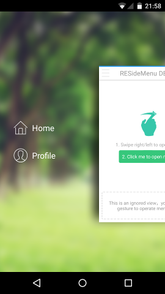
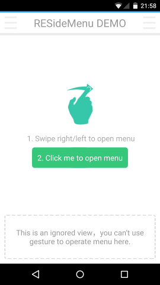
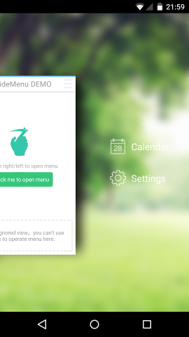

# Xamarin.Android.ResideMenu v0.1
A C# implementation of the [AndroidResideMenu](https://github.com/SpecialCyCi/AndroidResideMenu) by [SpecialCyCi](https://github.com/SpecialCyCi)

Currently a near direct translation of SpecialCyCi's repository. See TODO to see what I will be adding in the future.

## Installation ##

1. Clone the repo.
2. Build the ResideMenu project.
3. Reference "ResideMenu.dll" from your project; found under `"Xamarin.Android.ResideMenu\src\ResideMenu\bin\[Debug|Release]\ResideMenu.dll"`

## Demo App Screenshots ##

## TODO ##

* Support view layout attributes
* Support custom menu item layouts
* <del>Remove obsolete methods</del>
* <del>Replace call-back interfaces with events </del>
* <del>Replace Java int const pattern with .NET enums </del>
* <del>Refactor</del>

## License ##
Provided under the MIT license. See LICENSE for details.

## Thanks ##
[SpecialCyCi](https://github.com/SpecialCyCi)